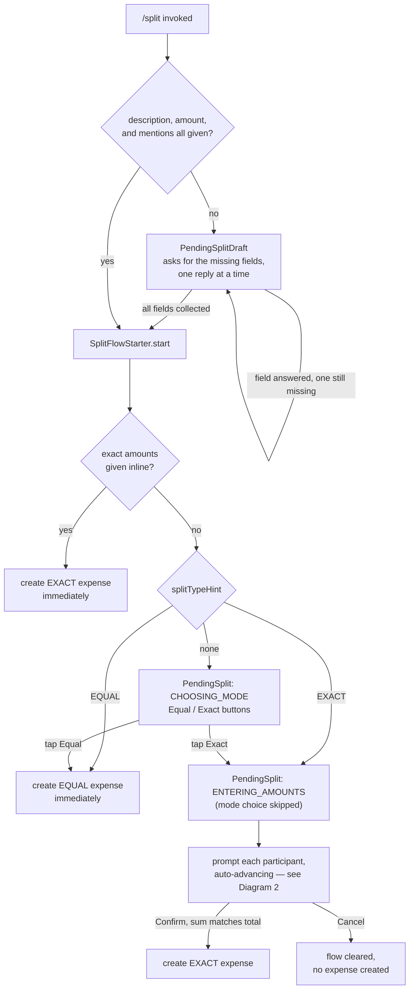
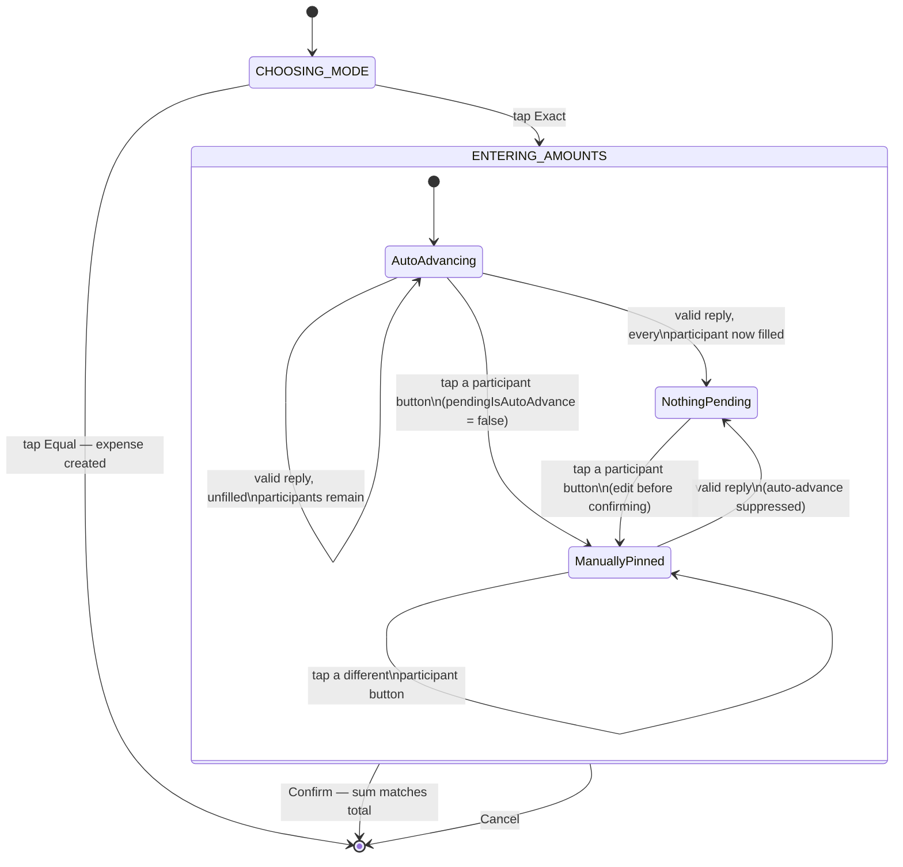

# Exact-amount split — design

## Purpose

`/split` currently only supports splitting an expense equally among its
participants (`resolveEqualSplit`). The `core` module already implements
`resolveExactSplit` (each participant's exact share, validated to sum to the
expense total) and `resolveSharesSplit`, both fully tested — the gap is
entirely in the Telegram adapter, which never calls anything but
`resolveEqualSplit`. This spec adds an interactive way to enter exact
per-person amounts. Shares-based splitting stays out of scope (not asked
for; `resolveSharesSplit` is unaffected and trivial to wire up later using
the same mechanics).

## Diagrams

### Diagram 1 — the guided flow end to end

### Diagram 2 — stages and the auto-advance flag

## Out of scope

- Shares-based splitting UX (`resolveSharesSplit` already exists in
  `core`, unused by the adapter; same mechanics could wire it up later).
- Multi-payer expenses / bill-photo attachment — raised as a possible
  second iteration during design, then dropped; not part of this spec.
- Persisting in-flight split state across a process restart.
