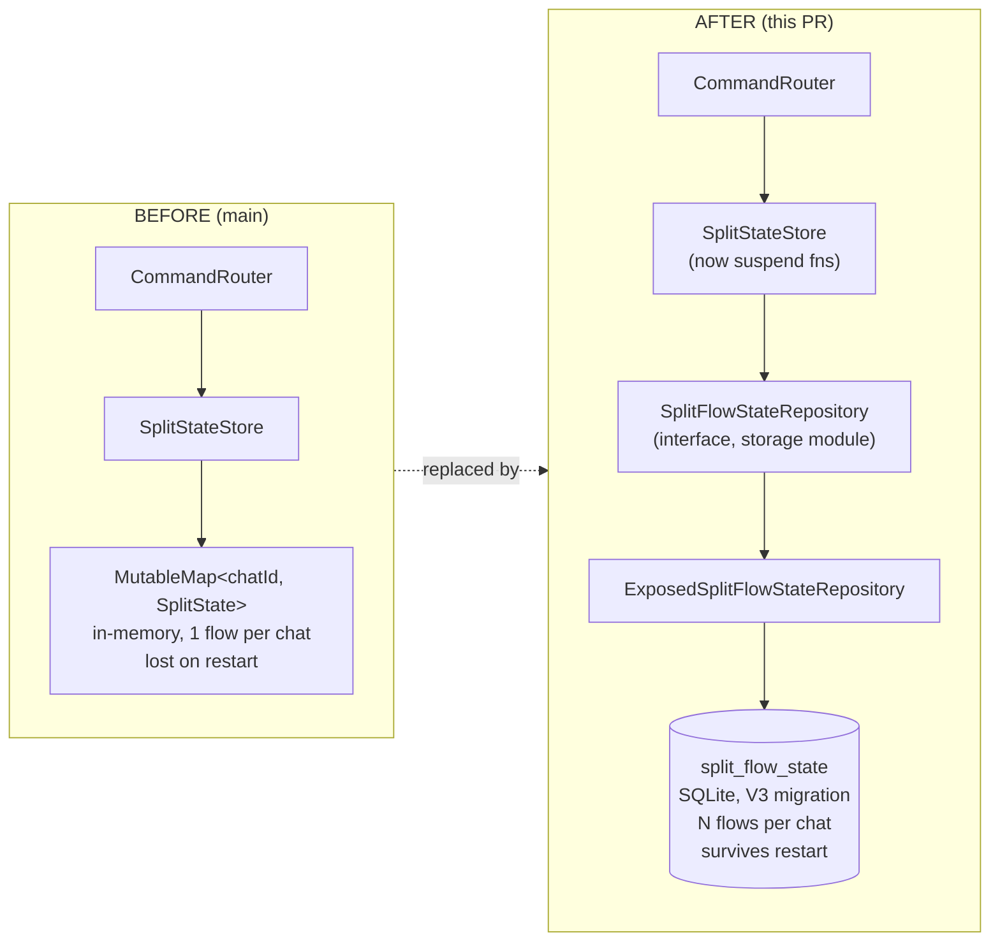
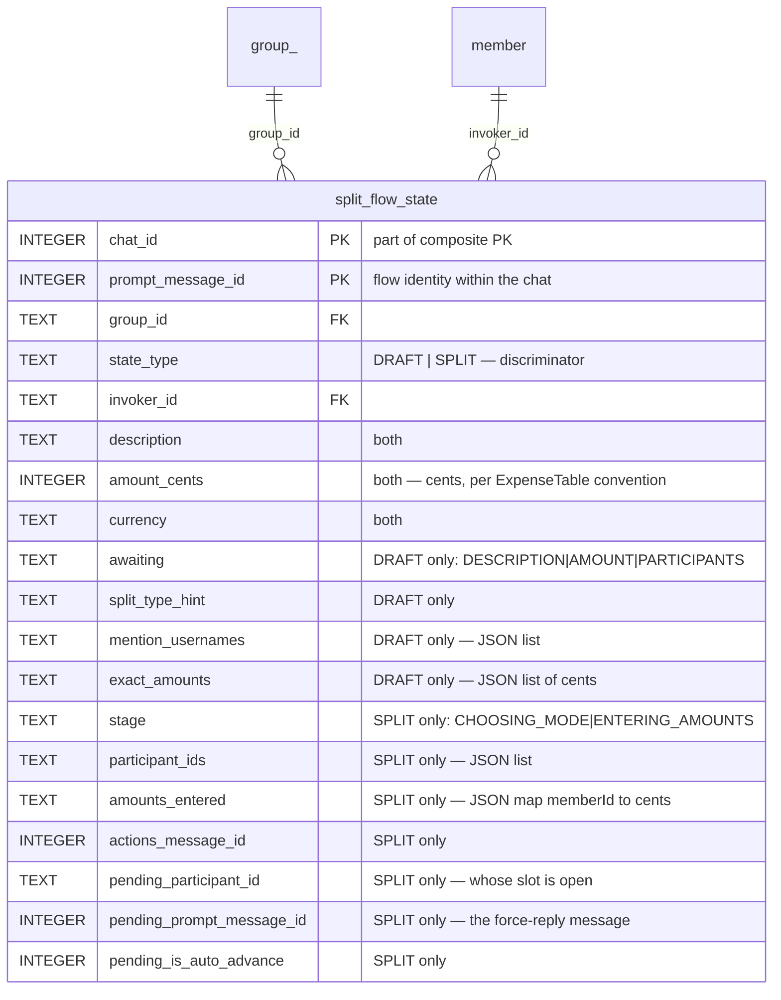
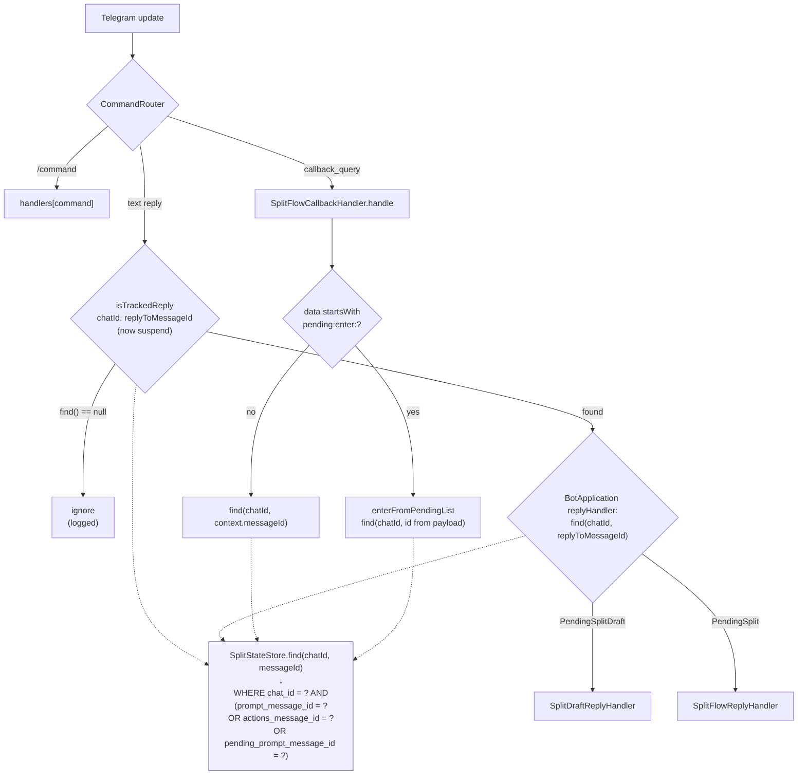
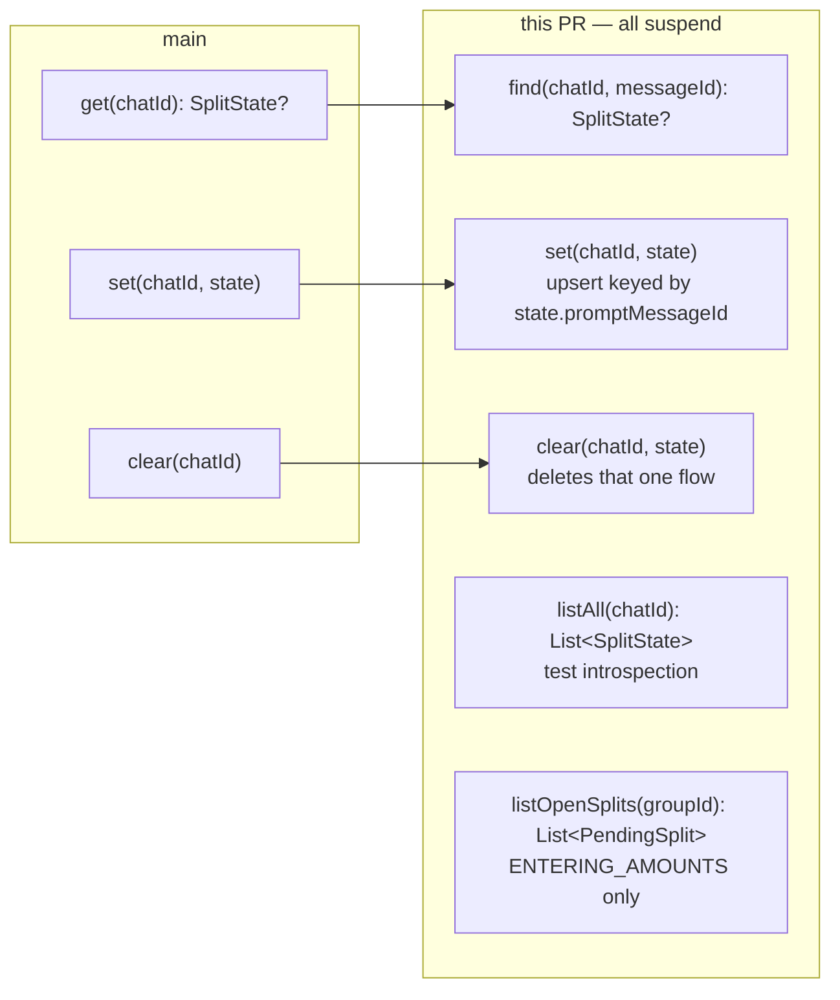
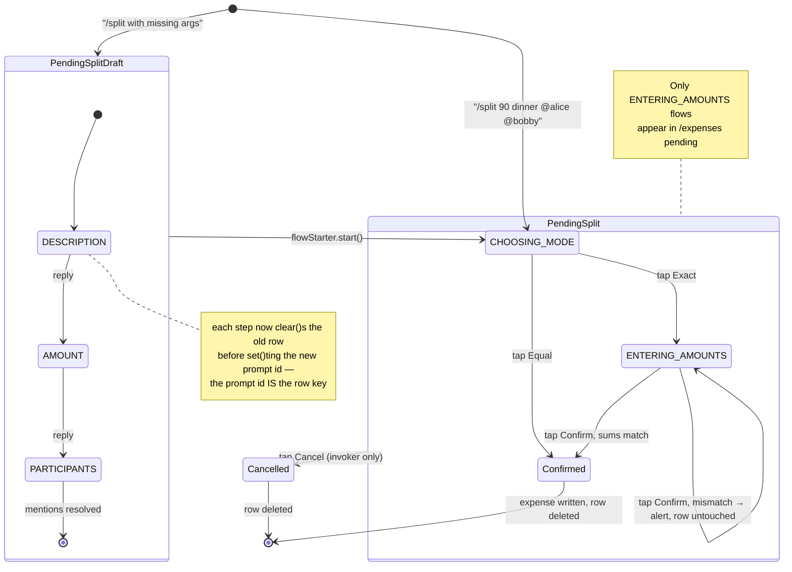
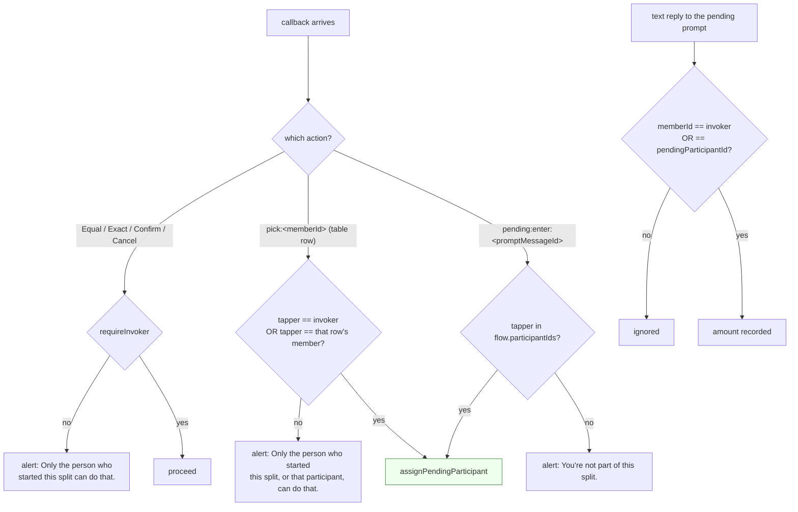
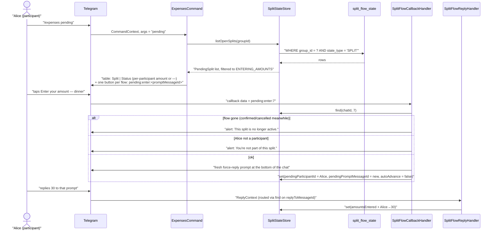
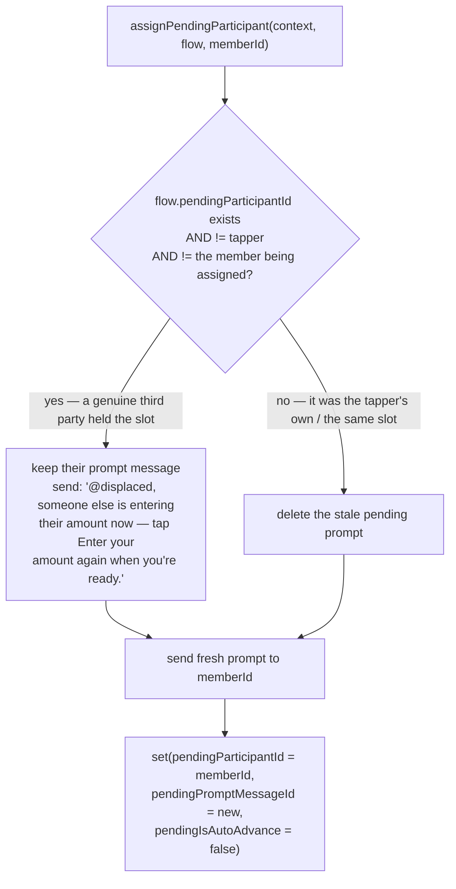

# PR walkthrough: self-service split entry & durable flow state

Branch `self-declared-split` vs `main` — 30 files, +3554/−149.
Spec: `docs/superpowers/specs/2026-09-04-self-service-split-entry-design.md`.
Plan: `docs/superpowers/plans/2026-09-04-self-service-split-entry.md`.

Three changes, one enabling the next:

1. **Durable state** — `SplitStateStore`'s in-memory map becomes a SQLite table (`split_flow_state`).
2. **Many flows per chat** — lookups key off a *message id*, not just the chat, so concurrent `/split`s coexist.
3. **Self-service entry** — participants answer their own amount; `/expenses pending` finds a flow that scrolled away.

---

## 1. Where state lives: before → after

New in `storage/`:

| File | Role |
| --- | --- |
| `SplitFlowState.kt` | `SplitFlowStateRow` DTO + `SplitFlowStateRepository` interface + `SplitFlowStateType` |
| `ExposedSplitFlowStateRepository.kt` | Exposed impl: `upsert`, `findByChatAndMessage`, `listByChat`, `delete`, `listSplitsByGroup` |
| `JsonColumns.kt` | encode/decode helpers for the JSON text columns (kotlinx-serialization-json added) |
| `Tables.kt` | `SplitFlowStateTable` |
| `V3__add_split_flow_state.sql` | the migration |

## 2. The table

One table for both `SplitState` variants, keyed by `(chat_id, prompt_message_id)`, with
`split_flow_state_group_idx (group_id, state_type)` for `/expenses pending`. Lists and maps are
JSON text — a flow is always read, mutated and written whole, so nothing needs to query inside them.

## 3. Dispatch: from "the chat's flow" to "the flow this message belongs to"

The central mechanical change. Every entry point used to ask "what is this chat doing?"; now it asks
"which flow does this message id belong to?" — and one SQL query answers it.

The three-way `OR` in `findByChatAndMessage` is what replaced the hand-rolled message-id checks that
used to live in `BotApplication.isTrackedReply`, `SplitFlowCallbackHandler.handle`, and
`SplitDraftReplyHandler`.

### Store API diff

`SplitState` gained `val promptMessageId` on the sealed interface, so `set`/`clear` can derive the row
key from any variant.

## 4. Flow lifecycle, now N-per-chat

Starting a second `/split` in a chat no longer orphans the first — it inserts a second row.

## 5. Who may do what (the actual behaviour change)

The single top-of-handler `memberId != flow.invokerId` gate is gone, replaced by per-action checks.

| Action | main | this PR |
| --- | --- | --- |
| Equal / Exact / Confirm / Cancel | invoker | invoker (unchanged) |
| `pick` someone else's row | invoker | invoker (unchanged) |
| `pick` **my own** row | invoker only | invoker **or that participant** |
| Reply with an amount | invoker only | invoker **or the pending participant** |
| Enter from `/expenses pending` | — | **any participant of that flow** |

## 6. `/expenses pending`

`buildPendingSplitsMessage` / `pendingSplitsKeyboard` / `pendingSplitEnterData` are the new formatting
functions; `PENDING_ENTER_PREFIX = "pending:enter:"`. Empty case: a plain "No pending splits." with no
keyboard. Entering the amount itself reuses the existing prompt-and-reply path — the list's only job
is to hand you a message you can reply to.

## 7. The slot-stealing race (last two commits)

`ENTERING_AMOUNTS` still has exactly one open slot. Two people can race for it, and the fix is about
not destroying a bystander's prompt:

Previously the old pending prompt was deleted unconditionally, which silently yanked the message a
third party was about to reply to.

## 8. Observability & dev-loop extras

Not behavioural, but most of the noise in `CommandRouter.kt`:

- `println` per dispatched command / callback / reply, plus explicit lines for the three ignore paths
  ("unknown command", "non-reply text", "reply to untracked message").
- `PollLoop` now prints a stack trace alongside the error message.
- `scripts/seed-test-members.sh <db>` inserts `@alice`, `@bobby`, `@carol` into the single group in a
  manual-test SQLite file (idempotent, guards on missing db / 0 groups / >1 group).
- README: the seeding step, and the gotcha that a relative `SPLIT_DB_PATH` resolves against
  `telegram/`, not the repo root.
- `/expenses pending` added to `HELP_TEXT`; the participants prompt now tells the invoker that
  unrecognized people must `/start` the bot first.
- detekt baseline: two new `TooManyFunctions` entries (`SplitFlowCallbackHandler`,
  `SplitFlowFormatting.kt`) and some `MaxLineLength` churn in specs.

## 9. Where the implementation diverged from the spec

Worth knowing if you read the spec first:

| Spec said | Shipped |
| --- | --- |
| `id TEXT PRIMARY KEY` generated key + `created_at` | composite PK `(chat_id, prompt_message_id)`, no `created_at` |
| indexes on `chat_id` and `(group_id, stage)` | one index on `(group_id, state_type)` |
| `listOpen(groupId)` | `listOpenSplits(groupId)`, with the `ENTERING_AMOUNTS` filter in Kotlin, not SQL |
| relax `pick` for self only | plus a whole new `pending:enter:` callback path |
| — | the third-party displacement notice (found while testing, added in the last two commits) |

Tests: +861/−98 lines across `ExposedSplitFlowStateRepositorySpec` (new), `SplitStateStoreSpec`,
`SplitFlowSpec`, `SplitFlowCallbackHandlerSpec`, `SplitFlowReplyHandlerSpec`,
`SplitFlowFormattingSpec`, `ExpensesCommandSpec`, `SplitDraftReplyHandlerSpec`.

One layering note: `telegram`'s `SplitStateStore` now imports `split.storage` types directly
(`SplitFlowStateRow`/`Repository`), where the other repository interfaces live in `core`.
