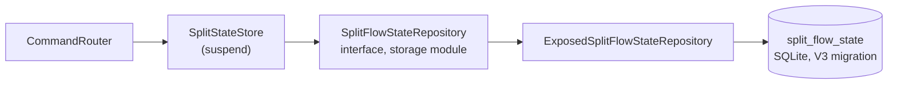
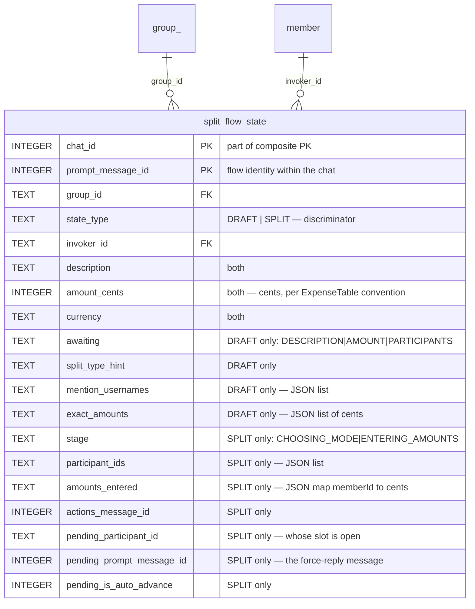
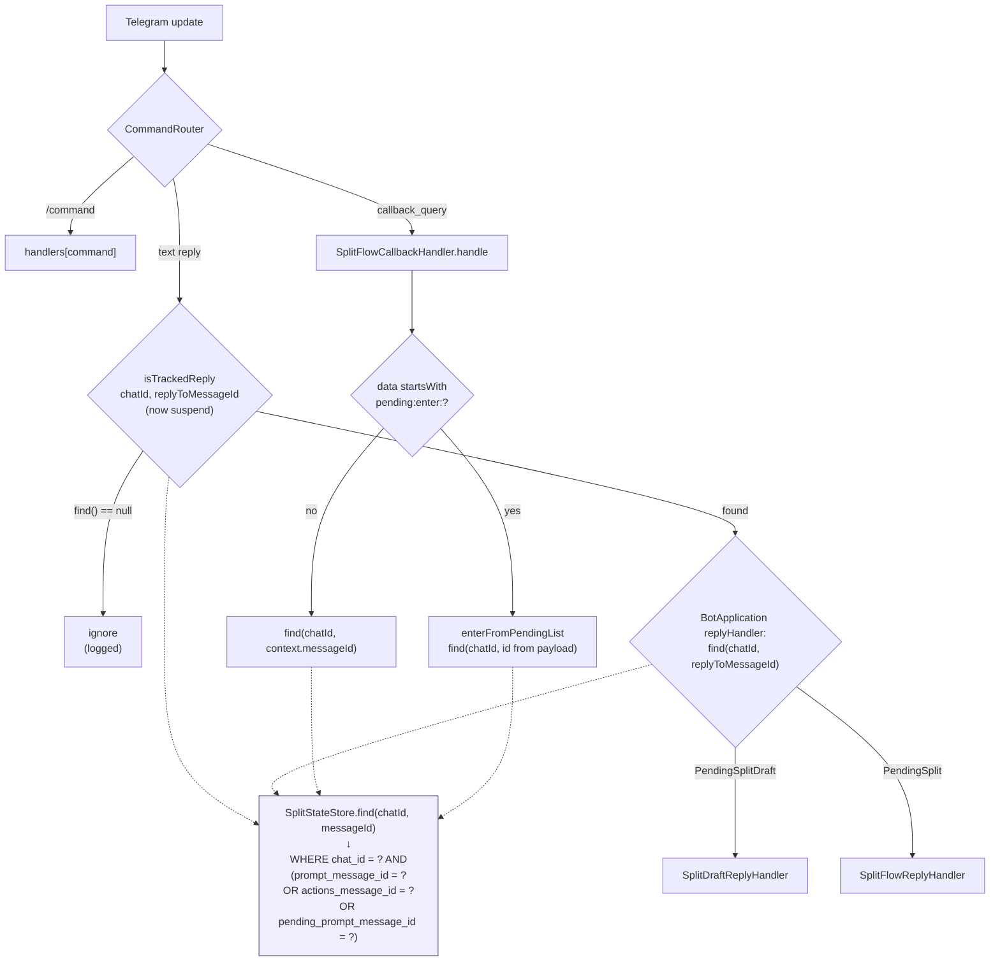
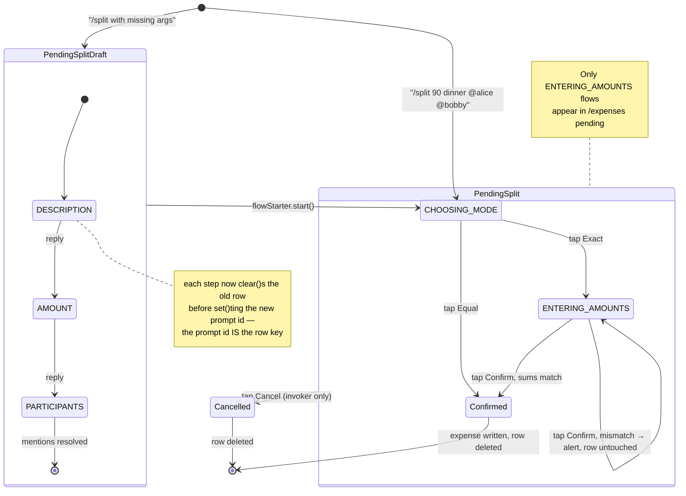
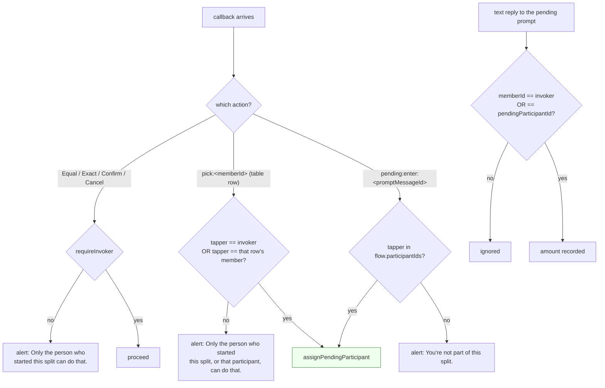
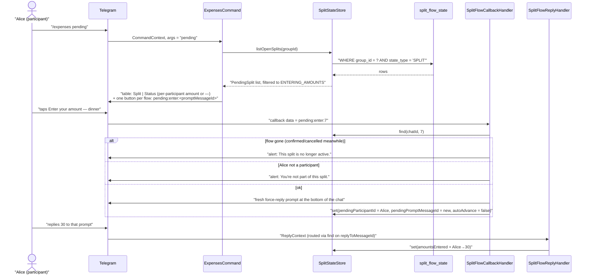
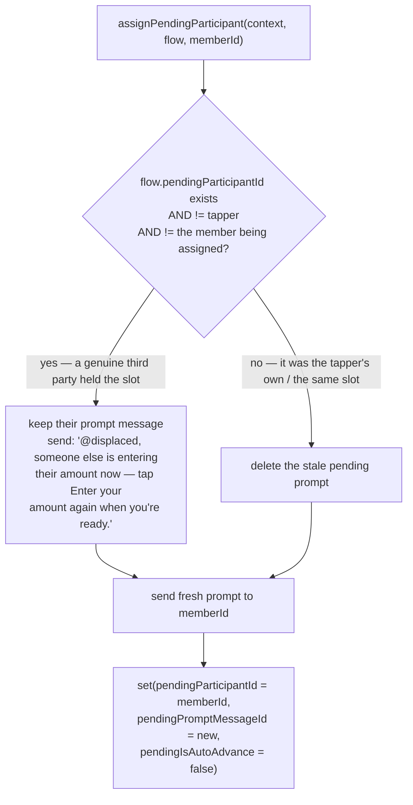

# The split flow

How `/split` works once it needs more than one message: where the in-flight state lives, how an
update is routed back to the flow it belongs to, who is allowed to do what, and how a participant
finds a split that has scrolled out of sight.

The behaviour itself is specified by the tests. `SplitFlowSpec` (under
`telegram/src/test/kotlin/split/telegram/splitflow/`) asserts against a rendering of the resulting
chat, so each test reads as a transcript of what participants see. This document covers the
structure those tests don't show, and the reasoning behind it.

Three properties hold the design together, each enabling the next:

1. **State is durable** — flows live in the `split_flow_state` table, so a restart doesn't drop
   whoever hasn't answered yet.
2. **Many flows per chat** — lookups key off a *message id*, not just a chat, so concurrent
   `/split`s coexist.
3. **Anyone named can answer** — a participant enters their own amount, and `/expenses pending`
   hands them a prompt when the original message is long gone.

---

## 1. Where state lives



This was an in-memory `MutableMap<chatId, SplitState>` until self-entry made flows long-lived: once
a split can sit open for hours waiting on someone, a deploy silently dropping it is no longer an
acceptable failure.

In `storage/`:

| File | Role |
| --- | --- |
| `SplitFlowState.kt` | `SplitFlowStateRow` DTO + `SplitFlowStateRepository` interface + `SplitFlowStateType` |
| `ExposedSplitFlowStateRepository.kt` | Exposed impl: `upsert`, `findByChatAndMessage`, `listByChat`, `delete`, `listSplitsByGroup` |
| `JsonColumns.kt` | encode/decode helpers for the JSON text columns (kotlinx-serialization-json added) |
| `Tables.kt` | `SplitFlowStateTable` |
| `V3__add_split_flow_state.sql` | the migration |

## 2. The table



One table for both `SplitState` variants, keyed by `(chat_id, prompt_message_id)`, with
`split_flow_state_group_idx (group_id, state_type)` for `/expenses pending`. Lists and maps are
JSON text — a flow is always read, mutated and written whole, so nothing needs to query inside them.

## 3. Dispatch: from "the chat's flow" to "the flow this message belongs to"

The central mechanical change. Every entry point used to ask "what is this chat doing?"; now it asks
"which flow does this message id belong to?" — and one SQL query answers it.



The three-way `OR` in `findByChatAndMessage` is what replaced the hand-rolled message-id checks that
used to live in `BotApplication.isTrackedReply`, `SplitFlowCallbackHandler.handle`, and
`SplitDraftReplyHandler`.

### Store API diff

All suspending, since every call reaches the database:

| Method | Purpose |
| --- | --- |
| `find(chatId, messageId)` | the flow this message belongs to, by any of its three tracked ids |
| `set(chatId, state)` | upsert, keyed by the state's own `promptMessageId` |
| `clear(chatId, state)` | remove that one flow, not the chat's only flow |
| `listAll(chatId)` | every flow open in the chat — test introspection |
| `listOpenSplits(groupId)` | `ENTERING_AMOUNTS` flows, for `/expenses pending` |

`promptMessageId` is declared on the sealed `SplitState` interface, so `set` and `clear` derive the
row key from any variant without caring which one they were handed.

## 4. Flow lifecycle



Starting a second `/split` in a chat no longer orphans the first — it inserts a second row.

## 5. Who may do what

The single top-of-handler `memberId != flow.invokerId` gate is gone, replaced by per-action checks.



| Action | Who may do it |
| --- | --- |
| Equal / Exact / Confirm / Cancel | the invoker only |
| `pick` someone else's row | the invoker only |
| `pick` your own row | the invoker, or that participant |
| Reply with an amount | the invoker, or the participant whose slot is open |
| Enter from `/expenses pending` | any participant of that flow |

The asymmetry is deliberate: deciding the split and closing it out stay with whoever started it,
while answering for yourself never needs their involvement.

## 6. `/expenses pending`



`buildPendingSplitsMessage` / `pendingSplitsKeyboard` / `pendingSplitEnterData` are the new formatting
functions; `PENDING_ENTER_PREFIX = "pending:enter:"`. Empty case: a plain "No pending splits." with no
keyboard. Entering the amount itself reuses the existing prompt-and-reply path — the list's only job
is to hand you a message you can reply to.

## 7. The slot-stealing race

`ENTERING_AMOUNTS` still has exactly one open slot. Two people can race for it, and the fix is about
not destroying a bystander's prompt:



Previously the old pending prompt was deleted unconditionally, which silently yanked the message a
third party was about to reply to.

## 8. Working on this

`CommandRouter` logs every dispatched command, callback and reply, and each of the three ways an
update is dropped — unknown command, non-reply text, reply to an untracked message. When a tap
appears to do nothing, that log says which of those happened.

For manual testing against real Telegram, seed a group first, since most of this needs more than
one member and you are the only real account in your own test chat:

```bash
./gradlew :telegram:seed --args="<chatId> members"
```

In-flight flows are deliberately not seedable — a `split_flow_state` row is keyed by Telegram
message ids, so a fabricated one points at messages that were never sent, leaving a row with no
table to look at and no buttons to tap. Seed the members, then start the split by hand.

## 9. Why it's built this way

The decisions that aren't recoverable from reading the code.

**Self-entry is folded into Exact, not a third mode.** A participant answering for themselves and
the payer filling in everyone produce the same expense by the same path — `resolveExactSplit` stays
the only finalization route, and the result is a `SplitType.EXACT` expense either way. Adding a
"self-service" mode would have meant a second way to reach an identical outcome, and a button
everyone has to understand before they can use either.

**One table with a `state_type` discriminator, not a normalized schema.** Unlike
`Expense`/`ExpenseShare`, which are queried independently for balances and per-member history, a
flow's participant list and entered amounts are never read on their own. Every access loads the
whole flow, mutates it, and writes it back — the same shape as the in-memory map it replaced. So
`participant_ids`, `amounts_entered` and `mention_usernames` are JSON text, and only the fields
actually queried — `chat_id`, `group_id`, `state_type`, the tracked message ids — are typed columns.

**Several flows per chat.** `/expenses pending` is only worth having if there can be more than one
thing pending. The old one-flow-per-chat ceiling also meant a second `/split` silently orphaned the
first, which was a latent bug rather than a feature.

**A sum mismatch rejects and leaves the flow open.** Confirm re-validates and shows the mismatch
without touching the row; the split is only ever closed by a successful Confirm or by Cancel.
Auto-adjusting someone's declared amount to make the total work would quietly put words in their
mouth, which is exactly what this flow exists to avoid.

**Deliberately absent.** No receipt parsing — the photo is context for the humans, not input for the
bot. No reminders or nudges to participants who haven't answered. No expiry on abandoned flows:
Cancel is the only way to close one early, and a TTL is worth adding only if abandoned rows turn out
to be a real problem.

**One layering wrinkle worth knowing.** `SplitStateStore` imports `SplitFlowStateRow` and
`SplitFlowStateRepository` from `split.storage` directly, whereas the other repository interfaces
the adapter uses (`ExpenseRepository`, `MemberRepository`, `PlatformDirectory`) live in `core`.
Flow state is adapter-level rather than domain state, so it doesn't belong in `core` — but the
inconsistency is real, and worth resolving if a second adapter ever appears.
