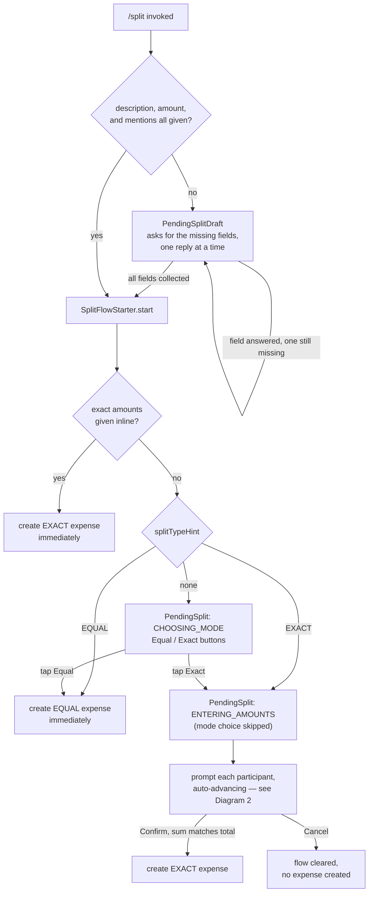
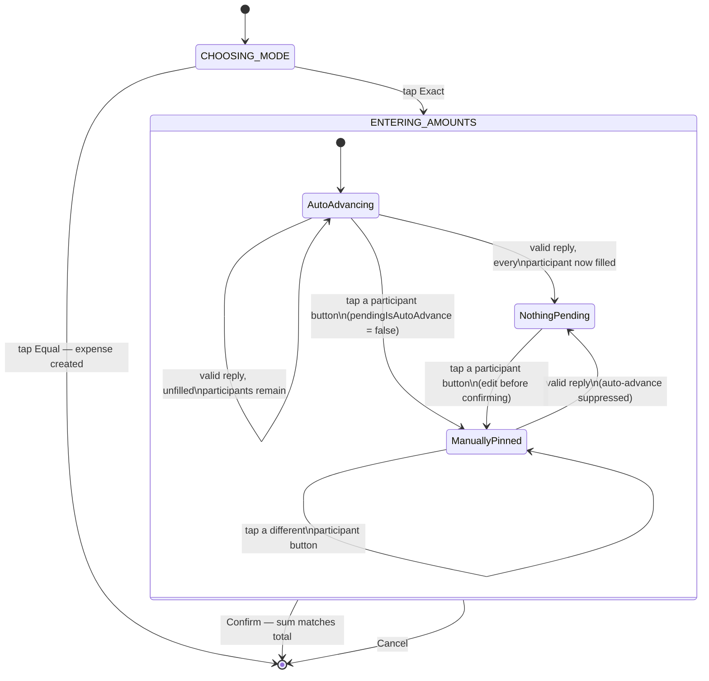

# Exact-amount split — design

## Purpose

`/split` currently only supports splitting an expense equally among its
participants (`resolveEqualSplit`). The `core` module already implements
`resolveExactSplit` (each participant's exact share, validated to sum to the
expense total) and `resolveSharesSplit`, both fully tested — the gap is
entirely in the Telegram adapter, which never calls anything but
`resolveEqualSplit`. This spec adds an interactive way to enter exact
per-person amounts. Shares-based splitting stays out of scope (not asked
for; `resolveSharesSplit` is unaffected and trivial to wire up later using
the same mechanics).

## UX overview

`/split 90 dinner @alice @bob` keeps parsing and resolving participants
exactly as today. Instead of immediately creating an `EQUAL` expense, it
sends **"How should this be split?"** with an inline keyboard:
**[Equal]** **[Exact]**.

- **Equal** — behaves exactly as today: the message is edited in place into
  the existing expense confirmation (`formatExpenseConfirmation`), and the
  `EQUAL` expense is created immediately.
- **Exact** — replaces that message with a **table message** and sends a
  second **actions message**:
  1. **Table message** — a rich-message table of participant → amount
     (`—` until filled), with one inline button per participant. This
     keyboard sets `InlineKeyboardMarkup.force_reply = true`: per the Bot
     API docs, *"pressing any button will open the reply composer"*
     targeting that message. So tapping "Alice" both fires a callback
     (telling the bot which participant was picked) and opens the reply
     composer for the invoker, pre-targeted at the table message — no
     separate "Enter Alice's amount" prompt message needed. Once a
     participant's amount is entered, their button is relabeled to show it
     (e.g. "Alice ✓ $50.00") and set to `disabled: true`.
  2. **Actions message** — "Entered $50.00 of $90.00" with **[Cancel]**
     **[Confirm]**, a *plain* keyboard (no `force_reply`, so tapping these
     never pops the reply composer). **Confirm** is `disabled: true` until
     every participant has an amount and they sum exactly to the total.

Two messages are needed, not one, because `force_reply` applies to the
*whole* keyboard, not per-button (confirmed against the live Bot API docs)
— Cancel/Confirm would otherwise also pop the composer.

**Entering an amount:** tapping a participant button answers the callback
and records "pending amount = this participant" in the flow's in-memory
state; the client opens the reply composer on the table message. The
invoker's next reply is matched by `reply_to_message.message_id` against
the table message id, checked against that pending participant, parsed as
a `BigDecimal`, and folded into state — then both the table and actions
messages are edited in place to reflect it. Tapping a different
participant before replying just moves the "pending" pointer.

**Confirm** re-resolves via the existing `resolveExactSplit` (which already
validates the sum), creates the `EXACT` expense, and edits the table
message into the standard `formatExpenseConfirmation` output; the actions
message is edited to a plain "Done." with its keyboard removed (reusing
`editMessageText`, rather than adding a `deleteMessage` method to
`TelegramApi` for this one case).

**Cancel** edits both messages to "Split cancelled." and clears the flow.

**Only the original `/split` invoker's taps and replies are honored.** A
callback from anyone else gets `answerCallbackQuery(..., showAlert = true)`
telling them only the person who ran `/split` can fill this in — this
follows directly from iteration 1's mental model (one person, the payer,
enters everyone's exact share; it's not each person self-reporting). A
reply from someone else is left alone: it isn't a command, and since it
isn't from the invoker it's simply not treated as this flow's answer
(existing router behavior already ignores non-command, non-matching text).

## Data flow / state

New in-process, in-memory `SplitStateStore`: a plain `MutableMap<Long,
SplitState>` keyed by chat id, where `SplitState` is either a
`PendingSplitDraft` (the guided-question phase) or a `PendingSplit` (mode
chosen, expense fields known) — a chat holds at most one, never both. No
synchronization needed, since `PollLoop` already processes updates one at a
time, sequentially (see `BotApplication.kt`). Not persisted to SQLite.

`PendingSplit` holds: the invoker's `MemberId`, the parsed expense fields
(amount, currency, description), the ordered participant list, amounts
entered so far, the table/actions message ids, and which participant (if
any) is the "pending" target for the next reply.

Starting a new `/split` in a chat replaces any existing pending flow for
that chat — the old flow's messages are left as-is. Any callback or reply
against a flow that's no longer the current one for its chat (replaced or
already completed) gets the same "this split is no longer active" answer
described under "Error handling" below, rather than silently doing nothing
or throwing.

**Restart loses in-flight flow state.** Accepted tradeoff for this bot's
scale (a handful of friends, single small instance) — a restart mid-entry
just means re-running `/split`. Not persisting this to SQLite avoids a
migration/table for what is, by nature, transient UI state.

## Diagrams

### Diagram 1 — the guided flow end to end

### Diagram 2 — stages and the auto-advance flag

## New Bot API surface

DTOs (`TelegramDtos.kt`):
- `TgUpdate` gains `callback_query: TgCallbackQuery?`.
- `TgCallbackQuery(id: String, from: TgUser, message: TgMessage?, data: String?)`.
- `TgMessage` gains `reply_to_message: TgMessage?` (nullable, self-referential — mirrors the real API shape; only ever populated one level deep in practice).
- `InlineKeyboardButton(text: String, callback_data: String? = null, disabled: Boolean? = null)`.
- `InlineKeyboardMarkup(inline_keyboard: List<List<InlineKeyboardButton>>, force_reply: Boolean? = null)`.

`TelegramApi` (extending, not duplicating, the existing methods — every
current call site ignores the new return value without needing changes):
- `sendMessage`/`sendRichMessage` gain an optional `keyboard:
  InlineKeyboardMarkup? = null` parameter and change their return type from
  `Unit` to `Long` (the sent message's id — needed to remember which
  message to edit/match replies against).
- New: `editMessageText(chatId: Long, messageId: Long, text: String, keyboard: InlineKeyboardMarkup? = null)`.
- New: `editRichMessage(chatId: Long, messageId: Long, richMessage: InputRichMessage, keyboard: InlineKeyboardMarkup? = null)`.
- New: `answerCallbackQuery(callbackQueryId: String, text: String? = null, showAlert: Boolean = false)` — must be called for every callback query Telegram sends us, or the tapping client shows a stuck loading spinner.

Exact JSON field shapes (especially `force_reply` and `disabled`, both
recent additions) get verified against the live Bot API reference again at
plan-writing/implementation time, the same way this codebase already
pins dependency versions "as verified current at plan-writing time" —
today's findings are a strong basis, not a substitute for checking at the
point of writing the serialization tests.

## Command/router changes

`CommandRouter.handleUpdate` currently only branches on `update.message`
with `/`-prefixed text. It gains two more branches, checked in this order:

1. `update.callbackQuery != null` — resolve `chatId` from
   `callbackQuery.message?.chat?.id`, resolve the tapper's `MemberId` via
   `IdentityResolver` (same as today's command path), and dispatch on a
   `data` prefix (`split:mode:equal`, `split:mode:exact`,
   `split:pick:<participant index>`, `split:cancel`, `split:confirm`) to a
   new small set of handlers. Always answers the callback query.
2. Non-command text message whose `reply_to_message.message_id` matches a
   pending flow's table message in that chat, and whose sender is that
   flow's invoker with a "pending" participant set — routed to the amount-
   entry handler instead of being ignored. Anything else (including
   replies with no pending participant, or from a non-invoker) falls
   through to today's existing "ignore" behavior.

`callback_data` encodes only a short action code plus a participant
*index* into the flow's stored participant list (not the participant's
full `MemberId`), keeping every value well under Telegram's 64-byte
`callback_data` limit and avoiding leaking ids into button payloads that
don't need them (the chat id, and therefore the flow, is already implicit
in which chat the callback came from).

## Error handling

- Non-numeric or unparseable reply → friendly error reply, re-prompt
  implicitly (the "pending" pointer is untouched, so the invoker can just
  try again), state otherwise unchanged.
- Non-invoker callback → `answerCallbackQuery` with `showAlert = true` and
  a message naming who can act on this split.
- Sum mismatch can't reach Confirm in practice (the button is `disabled`
  until the sum matches), but the handler re-validates via
  `resolveExactSplit`'s own `IllegalArgumentException` as a backstop and
  shows the mismatch rather than trusting client-side button state.
- A callback or reply against a flow that's been replaced or completed
  gets a short "this split is no longer active" answer rather than being
  silently dropped or throwing.

## Testing

Same conventions as the existing test suite: `FakeTelegramApi` extended
with the new methods (recording calls, returning deterministic message
ids), Kotest `StringSpec` tests running against a real temp-file SQLite
database (matching `IdentityResolverSpec`/`CommandRouterSpec`). Cases to
cover:

- Full happy path, Equal choice (unchanged behavior, still passes).
- Full happy path, Exact choice: pick each participant, reply with an
  amount, see the table/actions messages update, Confirm becomes enabled
  once the sum matches, tapping it creates the `EXACT` expense with the
  right `ExpenseShare` rows.
- Entering an amount for one participant, then a different amount for the
  same participant again before confirming (edit-before-submit).
- Invalid (non-numeric) amount reply.
- Callback or reply from someone other than the invoker is rejected.
- Cancel at various points in the flow.
- A second `/split` superseding a first, still-pending one.

No new `core`-level tests are needed — `resolveExactSplit` is already
fully covered by `ExactSplitResolutionSpec`.

## Out of scope

- Shares-based splitting UX (`resolveSharesSplit` already exists in
  `core`, unused by the adapter; same mechanics could wire it up later).
- Multi-payer expenses / bill-photo attachment — raised as a possible
  second iteration during design, then dropped; not part of this spec.
- Persisting in-flight split state across a process restart.
